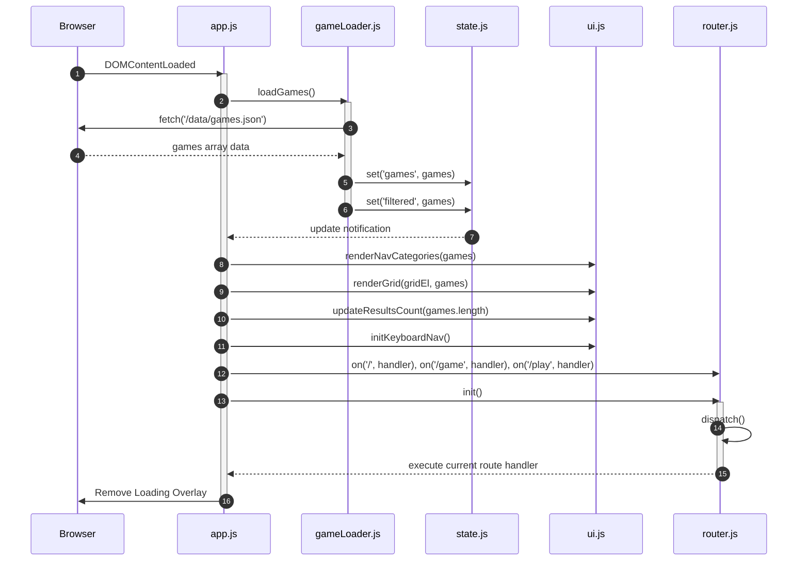

# 🪐 Frybahn System Documentation & Architectural Blueprint

This document serves as the absolute single source of truth for the **Frybahn** browser gaming portal. Refer to this document to understand the codebase, routing mechanics, state management, rendering pipeline, deployment configuration, and developer guidelines.

---

## 📖 Table of Contents
1. [Project Overview & Design Philosophy](#1-project-overview--design-philosophy)
2. [Codebase Directory Structure](#2-codebase-directory-structure)
3. [Architecture & Flow Diagram](#3-architecture--flow-diagram)
4. [Component & Module Specifications](#4-component--module-specifications)
   - [State Management (`state.js`)](#state-management-statejs)
   - [Router (`router.js`)](#router-routerjs)
   - [Game Loader (`gameLoader.js`)](#game-loader-gameloaderjs)
   - [UI & Rendering Engine (`ui.js`)](#ui--rendering-engine-uijs)
   - [Core Orchestrator (`app.js`)](#core-orchestrator-appjs)
   - [Utility Helpers (`utils.js`)](#utility-helpers-utilsjs)
5. [Data Model Schema (`games.json`)](#5-data-model-schema-gamesjson)
6. [Interactive Controls & Navigation Mechanics](#6-interactive-controls-navigation-mechanics)
   - [Keyboard Navigation Algorithm](#keyboard-navigation-algorithm)
   - [Focus Traps & Overlays](#focus-traps--overlays)
7. [Search Engine Optimization (SEO) & Accessibility (A11y)](#7-search-engine-optimization-seo--accessibility-a11y)
   - [Dynamic SEO Upgrades](#dynamic-seo-upgrades)
   - [Structured Data (JSON-LD) Schema](#structured-data-json-ld-schema)
   - [Accessibility Features](#accessibility-features)
8. [Docker & Nginx Deployment Configuration](#8-docker--nginx-deployment-configuration)
   - [Nginx Server Block (`docker/nginx.conf`)](#nginx-server-block-dockernginxconf)
   - [Dockerization (`Dockerfile` & `docker-compose.yml`)](#dockerization-dockerfile--docker-composeyml)
9. [Developer Submission Walkthrough](#9-developer-submission-walkthrough)

---

## 1. Project Overview & Design Philosophy

**Frybahn** is a lightweight, PlayStation-inspired web gaming portal designed for instant play. The application is built around the following core pillars:

*   **No Login or Friction:** Users click a card and start playing instantly.
*   **Console-Style UX:** The portal supports comprehensive navigation via keyboard controls (`Arrow Keys`, `Enter`, `Esc`, `/`), mimicking an console/arcade launcher dashboard.
*   **Performance First:** Built purely on **Vanilla HTML5, CSS3, and ES6 Javascript**. There are **no build steps, bundlers, or heavy framework dependencies**. The portal runs entirely static.
*   **Aesthetics:** A dark glassmorphism theme (`main.css`) using custom HSL/RGB colors, backdrop filters, neon glows, and custom entry animations (`animations.css`).
*   **Isolation:** Games run within sandboxed `<iframe>` elements to prevent script pollution or unauthorized parent window modifications.
*   **Zero-Code Scaling:** New games are added simply by creating a directory inside `games/` and creating a metadata entry in `data/games.json`.

---

## 2. Codebase Directory Structure

Below is the directory tree of the repository:

```
frybahn/
├── index.html              # Main SPA (Single Page Application) shell
├── about.html              # Static Page: About Us
├── faq.html               # Static Page: Frequently Asked Questions
├── developers.html        # Static Page: Developer Submission Portal Guide
├── privacy.html           # Static Page: Privacy Center Policy
├── blog.html              # Static Page: Developer Dev Blog
├── robots.txt             # SEO: Crawler Instructions
├── sitemap.xml            # SEO: Sitemap indexes
├── Dockerfile             # Containerization file (nginx-alpine based)
├── docker-compose.yml     # Docker Compose orchestration
├── docker/
│   └── nginx.conf          # Custom Nginx configuration with compression + routing
├── data/
│   ├── games.json          # Main database of game meta information
│   └── icon.svg            # Frybahn Vector Brand Logo
├── styles/
│   ├── main.css            # Dark glassmorphism styles, CSS tokens, layout classes
│   └── animations.css      # Keyframes for fade-ins, scales, and keyboard indicators
├── scripts/
│   ├── app.js              # Application entry point, router controller & coordinator
│   ├── state.js            # Central reactive pub/sub state manager
│   ├── gameLoader.js       # JSON loader, category builders, sorters, filters
│   ├── router.js           # History API pathname-based client-side router
│   ├── ui.js               # Grid renderer, detail view populator, keyboard navigation
│   └── utils.js            # General DOM manipulation & search input debouncing helpers
└── games/                  # Self-contained game directories (e.g. pacman, tetris, 2048)
```

---

## 3. Architecture & Flow Diagram

The application initializes as an event-driven SPA. The following diagram details the start-up sequence, data pipeline, and state updates:



---

## 4. Component & Module Specifications

### State Management (`scripts/state.js`)
A simple, reactive publish-subscribe (pub/sub) state store.
*   **State Interface**:
    ```javascript
    const state = {
      games: [],            // Complete database of game objects loaded from games.json
      filtered: [],         // Active array matching current sorting, filtering & search settings
      activeCategory: 'all',// Selected category filter
      searchQuery: '',      // Current search query string
      sortBy: 'popular',    // Active sort key: 'popular' | 'rating' | 'new'
      focusedCard: null,    // Currently focused card element in keyboard navigation
      currentGame: null,    // Selected game object currently in detail view or active play
    };
    ```
*   **API Methods**:
    *   `get(key)`: Returns current state value for a key.
    *   `set(key, value)`: Updates key, compares changes, and invokes registered callbacks.
    *   `on(key, callback)`: Registers listener function. Returns an unsubscribe function.
    *   `getAll()`: Returns shallow copy of state store.

### Router (`scripts/router.js`)
Lightweight client-side history router that maps `window.location.pathname` to dynamic callbacks.
*   **Core Logic**: Matches precise paths (e.g. `/`) or parameter patterns by checking prefixes (e.g., matching `/game/pacman` as route `/game` with argument `pacman`).
*   **Key Functions**:
    *   `on(path, handler)`: Registers path string and callback handler.
    *   `navigate(path)`: Wraps `window.history.pushState({}, '', path)` and triggers route dispatching.
    *   `init()`: Adds listener for browser `popstate` events and triggers initial dispatch.
    *   `currentRoute()`: Returns current relative path.

### Game Loader (`scripts/gameLoader.js`)
Responsible for fetching games database and applying filtering/sorting criteria.
*   **Functions**:
    *   `loadGames()`: Async fetches `/data/games.json` and updates `state.games` & `state.filtered`.
    *   `filterAndSort()`: Re-filters `state.games` using `state.activeCategory` and `state.searchQuery`. Sorts array based on `state.sortBy`:
        *   `popular`: Sorts descending by `players` count.
        *   `rating`: Sorts descending by `rating` value.
        *   `new`: Order matching game `id` UUID locale comparisons.
        *   Saves result to `state.filtered`.
    *   `getCategories(games)`: Parses unique categories across game roster, returns sorted array with `'all'` prefix.
    *   `groupByCategory(games)`: Groups game records into key-value map by their `category`.

### UI & Rendering Engine (`scripts/ui.js`)
Constructs and displays all layout markup inside container elements.
*   **Functions**:
    *   `renderCard(game)`: Builds game anchor node (`a.game-card`) with slug, description, rating, players, badge element, and play overlays.
    *   `populateGameDetail(game)`: Populates `#game-detail-overlay` with visual container elements, descriptions, controls guide, license, and repository links.
    *   `renderCategorySection(categoryName, games)`: Constructs a scrollable section row for categories when viewing `'all'` categories.
    *   `renderGrid(container, filtered)`: Generates empty state states or mounts category sections to `#game-grid`.
    *   `renderNavCategories(games)`: Generates horizontal selector navigation buttons in header.
    *   `initKeyboardNav()`: Binds document-wide `keydown` listeners for console-style control keys.

### Core Orchestrator (`scripts/app.js`)
Main entry point. Coordinates boot cycles, routes setups, and toggles detail/active overlays.
*   **Routes Configured**:
    *   `/` *(Home)*: Closes details & play overlays, sets active category filter to all.
    *   `/category/:cat`: Filters active category context, scrolls down to grid view.
    *   `/game/:slug`: Displays intermediate `#game-detail-overlay` modal, populates data, modifies SEO meta tags and Canonical links.
    *   `/play/:slug`: Launches target game within sandboxed `#game-iframe`, opens `#game-overlay`.
*   **UI Overlay Triggers**:
    *   `openGameDetails(game)`: Freezes page scroll, logs parent state SEO headers, populates, adds `.open` classes to detail panel, appends JSON-LD software metadata.
    *   `closeGameDetails()`: Hides detail view, restores original window SEO headers, removes dynamic script schemas.
    *   `openGame(game)`: Deactivates focusable elements behind modal by setting `aria-hidden="true"` on `#app`, launches game path source in iframe, and opens `#game-overlay`.
    *   `closeGame()`: Restores scrolling, unhides `#app`, and cleans up iframe source paths.

### Utility Helpers (`scripts/utils.js`)
Helper files to simplify DOM manipulation and formatting.
*   **Functions**:
    *   `debounce(fn, delay)`: Delays execution (used in game search input).
    *   `formatPlayers(n)`: Shrinks high number ranges to readable strings (e.g. `142000` -> `142K`, `1200000` -> `1.2M`).
    *   `clamp(val, min, max)`: Restricts numeric limits.
    *   `escapeHtml(str)`: Escapes raw input strings to protect against XSS injections.
    *   `qs(selector, root)` / `qsa(selector, root)`: Shorthand selectors.
    *   `el(tag, attrs, ...children)`: Programmatic custom DOM builder.

---

## 5. Data Model Schema (`games.json`)

All portal entries are configured in `data/games.json`. Each entry maps to the following object definition:

| Field | Type | Required | Description | Example |
| :--- | :--- | :--- | :--- | :--- |
| `id` | String | Yes | Unique UUID Identifier. | `"a1b2c3d4-e5f6-7890-abcd-ef1234567890"` |
| `title` | String | Yes | Name of the game. | `"Ghost Gobbler"` |
| `slug` | String | Yes | URL-friendly unique directory key. Matches folder in `games/`. | `"pacman"` |
| `category` | String | Yes | Game category (e.g., `arcade`, `puzzle`, `racing`, `action`, `strategy`). | `"arcade"` |
| `thumbnail`| String | Yes | Optional image preview. Can be empty string to fallback to `emoji`. | `""` or `"/games/pacman/thumb.png"` |
| `emoji` | String | Yes | Single emoji used as visual fallback icon. | `"👾"` |
| `description`| String | Yes | Rich HTML text content explaining the game. | `"<p>An affectionate tribute...</p>"` |
| `players` | Number | Yes | Mock player engagement count (used for sorting). | `48210` |
| `rating` | Number | Yes | Floating rating score out of 5. | `4.7` |
| `badge` | String | No | Corner ribbon display: `popular` \| `trending` \| `new` \| `""`. | `"popular"` |
| `path` | String | Yes | Path to game entry file (relative to root server index). | `"/games/pacman/index.html"` |
| `isPlayable`| Boolean| Yes | Indicates if game launch mode is supported. | `true` |
| `license` | String | Yes | Software distribution licensing term. | `"MIT"` |
| `source` | String | No | GitHub or original project source repository URI. | `"https://github.com/..."` |
| `howToPlay` | String | No | Custom control hints text displayed in detail panel. | `"Use Arrow keys to navigate."` |

---

## 6. Interactive Controls & Navigation Mechanics

Frybahn supports a dual-input model: standard pointer interaction (mouse click, touch tap) and a full keyboard system.

### Keyboard Navigation Algorithm
Inside the home grid, users navigate the grid using arrows:
*   `ArrowRight` / `ArrowLeft`: Navigates to the next/previous card inside the current container lists.
*   `ArrowDown` / `ArrowUp`: Targets cards in adjacent rows based on vertical positioning.

#### Vertical Movement Calculation
To calculate the target card when moving vertically across category rows, `ui.js` performs the following geometric search:
1. Calculates center coordinate `centerX` of the active card:
   $$\text{centerX} = \text{rect.left} + \frac{\text{rect.width}}{2}$$
2. Filters potential card elements based on vertical boundary constraints relative to direction:
   *   **Down**: Target card top bounding line must fall below the current card's vertical center.
   *   **Up**: Target card bottom bounding line must sit above the current card's vertical center.
3. For all valid candidates, calculates a weighted geometric distance:
   $$\text{distance} = |\text{candidate.centerX} - \text{centerX}| + (2 \times |\text{candidate.top} - \text{rect.top}|)$$
   *(Vertical offsets are weighted $2\times$ to prioritize column vertical alignment over horizontal offsets).*
4. Selects candidate with the smallest distance and triggers scroll:
   ```javascript
   cards[focusedCardIndex].focus();
   cards[focusedCardIndex].scrollIntoView({ behavior: 'smooth', block: 'nearest' });
   ```

### Focus Traps & Overlays
Modals capture keyboard attention dynamically using focus trap constraints. When `#game-overlay` or `#game-detail-overlay` is open, `Tab` and `Shift+Tab` keys cycle focus exclusively within the modal's interactive buttons:

```javascript
const FOCUSABLE_SELECTORS = 'button, [href], input, select, textarea, [tabindex]:not([tabindex="-1"]), iframe';
```

If focus hits the last focusable element in the modal container during standard forward navigation (`Tab`), the handler overrides the event to redirect focus back to the first interactive child, and vice versa for backward navigation (`Shift+Tab`).

---

## 7. Search Engine Optimization (SEO) & Accessibility (A11y)

### Dynamic SEO Upgrades
When a user opens `/game/:slug`, `app.js` updates meta headers in real-time to preserve individual indexability for search crawlers:

*   **Document Title**: Updates to `${game.title} — Play Free on Frybahn`.
*   **Description Meta**: Overwrites the content of `meta[name="description"]` with the game's description.
*   **Canonical Link**: Updates `link[rel="canonical"]` to the game's deep-link URI: `https://frybahn.com/game/${slug}`.
*   **Social Graphs**: Re-assigns Facebook Open Graph (`og:title`, `og:description`, `og:url`, `og:image`) and Twitter Card (`twitter:title`, `twitter:description`, `twitter:url`, `twitter:image`) content tags.
*   **State Restoration**: All original headers are cached inside `state` upon opening the modal, and restored once the user closes the overlay and returns to `/`.

### Structured Data (JSON-LD) Schema
Upon opening a game's detail view, the system dynamically generates and injects a structured schema script into the `<head>` of `index.html`:

```json
{
  "@context": "https://schema.org",
  "@type": "SoftwareApplication",
  "name": "Ghost Gobbler",
  "description": "...game description...",
  "applicationCategory": "GameApplication",
  "operatingSystem": "Web Browser",
  "url": "https://frybahn.com/game/pacman",
  "image": "https://frybahn.com/data/icon.svg",
  "aggregateRating": {
    "@type": "AggregateRating",
    "ratingValue": 4.7,
    "bestRating": "5",
    "ratingCount": 48210
  },
  "offers": {
    "@type": "Offer",
    "price": "0",
    "priceCurrency": "USD"
  }
}
```

The script is tagged with `id="dynamic-game-schema"` and is removed from the DOM upon modal exit.

### Accessibility Features
*   **Screen Reader Isolation**: Setting `aria-hidden="true"` on `#app` when a game is running inside `#game-overlay` ensures screen readers do not read contents of the home page underneath the active modal.
*   **Live Announcement**: The results counter element utilizes `aria-live="polite"` to announce item counts dynamically as users filter games.
*   **Controls Visibility**: A keyboard helper visual panel (`.keyboard-hint`) slides into view on the first arrow key press to introduce controls to new players.

---

## 8. Docker & Nginx Deployment Configuration

Frybahn runs inside a lightweight Alpine container behind an optimized static file server configuration.

### Nginx Server Block (`docker/nginx.conf`)
*   **Gzip Compression**: Gzip compression is enabled at level 6 for all core assets: `text/plain`, `text/css`, `application/javascript`, `application/json`, `image/svg+xml`, and font file formats (`woff`, `woff2`).
*   **Caching Rules**:
    *   **Statics**: Custom headers specify static assets (images, stylesheets, scripts, JSON metadata maps, fonts) can be cached by client browsers for **1 year (`expires 1y;`)** with `Cache-Control "public, immutable"`.
    *   **HTML**: Configured with `Cache-Control "no-store, no-cache, must-revalidate"` to force immediate browser revalidation.
*   **Security Headers**:
    *   `X-Frame-Options: SAMEORIGIN` (prevents third-party clickjacking exploits).
    *   `X-Content-Type-Options: nosniff` (mitigates content-type sniffing).
*   **SPA Path Fallback**:
    ```nginx
    location / {
        try_files $uri $uri/ $uri.html /index.html;
    }
    ```
    This fallback maps path routes (e.g. `/game/pacman` or `/category/arcade`) directly back to the index shell, letting the client-side router handle the view logic.

### Containerization (`Dockerfile` & `docker-compose.yml`)
*   **Base Layer**: `nginx:1.25-alpine`.
*   **Healthcheck Directive**:
    *   `HEALTHCHECK` calls `wget -qO- http://localhost:90/ || exit 1` every 30 seconds to monitor status.
*   **Docker Compose Mapping**:
    *   Maps host port `90` to container port `90` for routing. Sets container restart policy to `unless-stopped`.

---

## 9. Developer Submission Walkthrough

Adding a game to the Frybahn portal requires no code changes to the shell framework itself. Follow this step-by-step procedure:

### Step 1: Create the game directory
1. Create a subfolder inside `games/` matching your game's slug:
   ```bash
   mkdir games/my-cool-game
   ```
2. Place your entry point `index.html` inside this folder.
3. Ensure all internal assets (images, sound tracks, scripts) use relative paths (e.g., `src="./player.js"` or `url("./sprite.png")`).

> [!IMPORTANT]
> Your game runs within a sandboxed `<iframe>` with `sandbox="allow-scripts allow-same-origin"`. It must run entirely on the client side, require no access to the parent window, and use no external API database connections.

### Step 2: Register metadata in `data/games.json`
Append a new JSON entry to `data/games.json`:

```json
{
  "id": "generate-a-new-uuid-here",
  "title": "My Cool Game",
  "slug": "my-cool-game",
  "category": "arcade",
  "thumbnail": "",
  "emoji": "🏎️",
  "description": "<p>A short paragraph detailing features...</p>",
  "players": 1200,
  "rating": 4.5,
  "badge": "new",
  "path": "/games/my-cool-game/index.html",
  "isPlayable": true,
  "license": "MIT",
  "source": "https://github.com/myusername/my-cool-game",
  "howToPlay": "Use <b>W/A/S/D</b> keys to drive."
}
```

### Step 3: Run and test locally
1. Launch docker containers in build mode:
   ```bash
   docker compose up -d --build
   ```
2. Visit `http://localhost:90/` in your browser.
3. Verify keyboard navigation, SEO meta tags, and overlay scaling function correctly.
